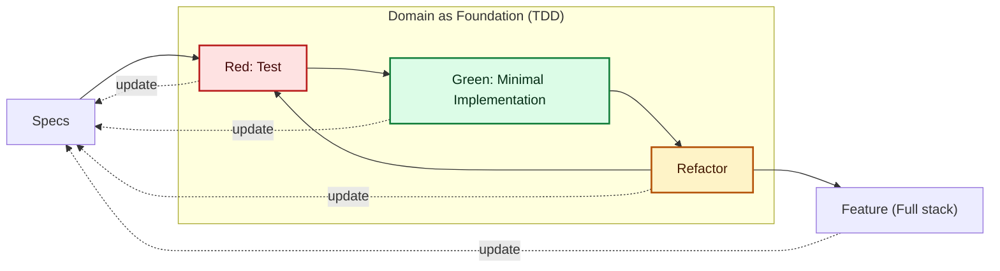
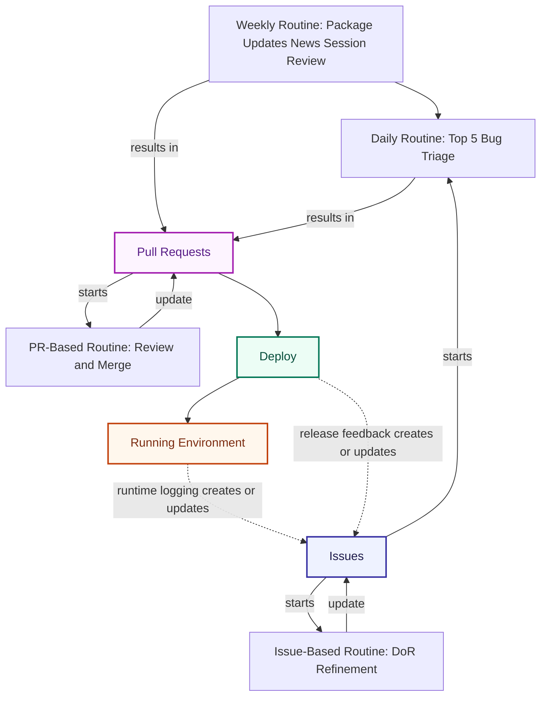

# Hi, I am Job Schepers (JSdotNet)

> **Architect brain, developer hands.**

On this GitHub, I build practical developer tooling around .NET, Copilot, and architecture workflows. Most of my work is about turning complex ideas into reusable building blocks: MCP servers, agent/instruction/skill packs, and experiments that shorten feedback loops and improve day-to-day engineering.

Here on GitHub, I intentionally build many of my own tools and workflows instead of only adopting what already exists, because building is how I learn fastest and understand trade-offs deeply. This is my learning sandbox approach, not a one-size-fits-all rule for customer projects.

## What I Enjoy Building

- .NET + Aspire systems that stay maintainable after release day
- Domain-Driven Design and modular monoliths with clear boundaries
- GitHub Copilot workflows with reusable agents, instructions, and skills
- Architecture and quality guardrails that teams can actually use

## How I Work

I have been building software for 20+ years, and I still prefer practical engineering over buzzwords.

> **Measure twice, implement once.**

My default approach is practical and explicit:

- Specification-first: define intent and acceptance criteria before implementation.
- Domain-driven: shape bounded contexts, language, and boundaries before wiring technology.
- TDD as a domain sub-process: use Red/Green/Refactor cycles inside each domain slice for executable design and fast feedback.
- Architecture guardrails: keep decisions visible through guidelines, templates, and repeatable standards.
- AI as a harness: combine MCP guidelines, reusable Copilot agents, and instruction/skill packs so AI output stays aligned with architecture.
- Human in the loop is applied every step of the way, from specs and DoR to review and deploy decisions.

In the current projects, this shows up as a living workflow: write specs and structure first, implement in small slices, and continuously refine based on what we learn.

Workflow snapshot:

### Automations and Routines

I use lightweight automation rhythms to keep work moving and quality visible:

- Daily: triage GitHub bugs, for example working through the top 5 issues labeled bug.
- Weekly: run package updates, review technical news, and run session reviews to improve routines and AI-Harnass.
- Issue-based: refine issue content to Definition of Ready (DoR) before implementation starts.
- PR-based: run structured pull-request reviews, resolve remarks, and tighten specs/docs before merge.

## What I Am Building

- [Copilot](https://github.com/JSdotNet/Copilot)  
  Plugin ecosystem with agents, instructions, and skills for architecture, coding, docs, and reviews.  
  State: Active and evolving (new plugins, skills, and orchestration patterns).

- [Project-Guidelines-MCP](https://github.com/JSdotNet/Project-Guidelines-MCP)  
  MCP server that gives Copilot and compatible tools direct access to architecture and coding guidelines.  
  State: Active foundation for my AI harness (expanding guideline coverage and integrations).

- [Backlog](https://github.com/JSdotNet/Backlog)  
  AI-driven work management for backlog items, prompts, knowledge, and project flow.  
  State: In setup and discovery (shaping workflow, domains, and first implementation slices).

- [Lets-BBQ](https://github.com/JSdotNet/Lets-BBQ)  
  AI-first .NET 10 playground for spec-first development and modular monolith experiments.  
  State: Planned (next sandbox for testing architecture choices, AI workflow patterns, and delivery loops).

## Collaboration

If you like architecture, clean domain boundaries, and making AI actually useful in day-to-day engineering, we will probably get along.

- Repositories: https://github.com/JSdotNet?tab=repositories
- LinkedIn: https://www.linkedin.com/in/job-schepers-35677b20/

