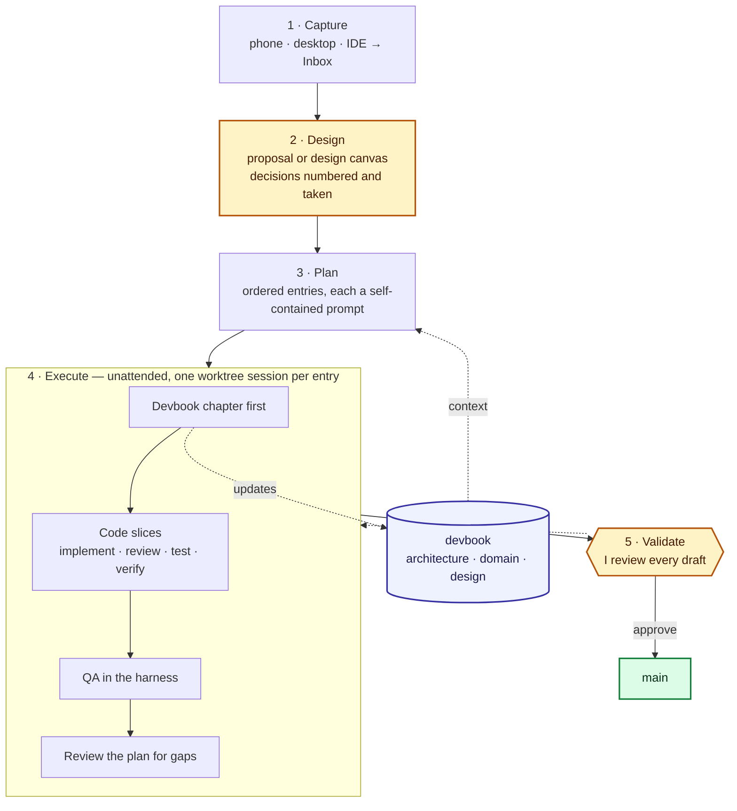
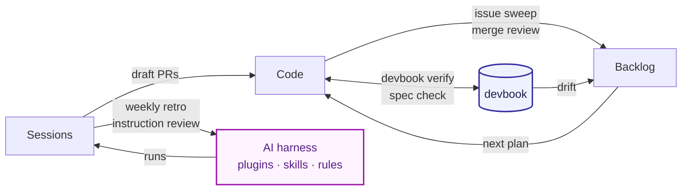

# Hi, I am Job Schepers (JSdotNet)

> **Architect brain, developer hands.**

I build practical developer tooling around .NET, AI coding agents, and architecture workflows. Right now that means a spec-driven delivery stack for **Claude Code and GitHub Copilot** — plugins, flows, and scheduled routines that keep AI output aligned with architecture — and the products I build with it.

Here on GitHub, I intentionally build many of my own tools and workflows instead of only adopting what already exists, because building is how I learn fastest and understand trade-offs deeply. This is my learning sandbox approach, not a one-size-fits-all rule for customer projects.

## What I Enjoy Building

- .NET + Aspire systems that stay maintainable after release day
- Domain-Driven Design and modular monoliths with clear boundaries
- AI delivery workflows for Claude Code and GitHub Copilot: reusable agents, skills, and flows, authored once for both hosts
- Architecture and quality guardrails that teams can actually use

## How I Work

I have been building software for 20+ years, and I still prefer practical engineering over buzzwords.

> **Measure twice, implement once.**

These days agents write most of the code. I spend my time where it matters: making decisions and validating results. Every change goes from idea to `main` along the same five steps. Steps 2 and 5 are mine; the rest runs on agents.

1. **Capture.** Ideas, bugs, and notes land in the Inbox of [Backlog](https://github.com/JSdotNet/Backlog), from my phone, the desktop, or the IDE.
2. **Design.** A proposal or a design canvas, with every open decision numbered and then taken. Nothing is planned while a decision is still open.
3. **Plan.** The design is imported as a Backlog plan: 10 to 15 entries in dependency order. Each entry is a self-contained prompt holding the settled facts, the files, the design board, and the tests. The first entry updates the devbook chapter, so the spec moves before the code. The last ones validate the result in a test harness and check the plan for anything that was missed.
4. **Execute.** The plan runs unattended. Each entry gets its own worktree session that runs the [delivery flow](https://github.com/JSdotNet/devbook): implement and review per slice, build and test, verify, spec check. Each entry lands as a draft pull request and reports back what it checked, what changed along the way, and what it could not prove.
5. **Validate.** I review every draft before it merges. Nothing reaches `main` without that personal validation.

```mermaid
flowchart TB
  CAP["1 · Capture<br/>phone · desktop · IDE → Inbox"] --> DES
  DES["2 · Design<br/>proposal or design canvas<br/>decisions numbered and taken"] --> PLAN
  PLAN["3 · Plan<br/>ordered entries, each a self-contained prompt"] --> EXE

  subgraph EXE["4 · Execute — unattended, one worktree session per entry"]
    direction LR
    E1["Devbook chapter first"] --> E2["Code slices<br/>implement · review · test · verify"]
    E2 --> E3["QA in the harness"] --> E4["Review the plan for gaps"]
  end

  EXE -->|"draft PR per entry<br/>+ report back"| PV{{"5 · Validate<br/>I review every draft"}}
  PV -->|approve| MAIN["main"]
  PV -.->|revise| EXE

  DB[("devbook<br/>architecture · domain · design")]
  DB -. context .-> PLAN
  E1 -. updates .-> DB

  classDef me fill:#FEF3C7,stroke:#B45309,stroke-width:2px,color:#451A03;
  classDef docs fill:#EEF2FF,stroke:#3730A3,stroke-width:2px,color:#1E1B4B;
  classDef done fill:#DCFCE7,stroke:#15803D,stroke-width:2px,color:#052E16;
  class DES,PV me;
  class DB docs;
  class MAIN done;
```

The principles behind it:

- **Specification first.** The devbook (arc42, domain, design, and tech chapters) is the source of truth, and after every change a spec check reports whether code and chapter still agree.
- **Domain-driven.** Bounded contexts, ubiquitous language, and modular boundaries come before wiring technology. Inside each domain slice, Red/Green/Refactor keeps the design executable.
- **Small, reviewable slices.** One entry, one session, one draft pull request. That keeps sessions parallel and reviews short.
- **Human in the loop at the decisions.** I take the design decisions and I approve every result. Agents handle the work in between.

### Routines and Feedback Loops

35 scheduled routines across five repositories keep the work honest while I am not looking. They land as draft pull requests or short briefs, never as merges:

| Cadence | Routines |
| --- | --- |
| Daily | Devbook validation |
| Weekdays | Issue sweep (classify, close what is resolved, draft fixes), merge review, morning brief |
| Weekly | Package and stack updates, technology graph refresh, devbook verify (spec against code), prose and instruction review, change report, weekly update |
| Weekend | Retro over every session in every repository, landing improvements in the tooling itself |

```mermaid
flowchart LR
  CODE["Code"] <-->|"devbook verify<br/>spec check"| SPEC[("devbook")]
  CODE -->|"issue sweep<br/>merge review"| INBOX["Backlog"]
  SPEC -->|"drift"| INBOX
  INBOX -->|"next plan"| CODE

  SESS["Sessions"] -->|"weekly retro<br/>instruction review"| HARN["AI harness<br/>plugins · skills · rules"]
  HARN -->|"runs"| SESS
  SESS -->|"draft PRs"| CODE

  classDef docs fill:#EEF2FF,stroke:#3730A3,stroke-width:2px,color:#1E1B4B;
  classDef harness fill:#FDF4FF,stroke:#A21CAF,stroke-width:2px,color:#581C87;
  class SPEC docs;
  class HARN harness;
```

There are three loops. Code and spec are checked against each other. Findings flow back into the backlog. And the way I work with AI is reviewed every weekend and improved as code, in the same repositories as everything else.

## What I Am Building

- [devbook](https://github.com/JSdotNet/devbook)  
  Plugin marketplace for the devbook convention (addressed architecture, domain, tech, design, and AI chapters) and the delivery engine: `flow-code` / `flow-spec`, live run dashboards, and scheduled routines for Claude Code Routines and Copilot Automations.  
  State: Active, the core of my AI harness (released in lockstep across all plugins).

- [ai-plugins](https://github.com/JSdotNet/ai-plugins)  
  Specialist plugins the flows consult — architecture, C#, React, QA, domain design, UX, documentation, security — each authored once and loaded by both Claude Code and GitHub Copilot.  
  State: Active and evolving.

- [Backlog](https://github.com/JSdotNet/Backlog)  
  Local-first, AI-first work management for work items, prompts, knowledge, roadmaps, and devbooks — a desktop app (MSIX), an Android app, IDE integration, and a thin sync service.  
  State: In use and released continuously.

- [finance](https://github.com/JSdotNet/finance)  
  Personal finance tracker, set up devbook-first: architecture, domain, and design defined before the first feature.  
  State: Early (specs and structure in place).

- [Project-Guidelines-MCP](https://github.com/JSdotNet/Project-Guidelines-MCP)  
  .NET MCP servers that serve architecture, coding, and design guidelines to AI assistants, plus a publish-results server.  
  State: Maintained.

- [Lets-BBQ](https://github.com/JSdotNet/Lets-BBQ)  
  .NET 10 + Aspire modular-monolith sandbox for spec-first development.  
  State: On hold.

## Collaboration

If you like architecture, clean domain boundaries, and making AI actually useful in day-to-day engineering, we will probably get along.

- Repositories: https://github.com/JSdotNet?tab=repositories
- LinkedIn: https://www.linkedin.com/in/job-schepers-35677b20/

